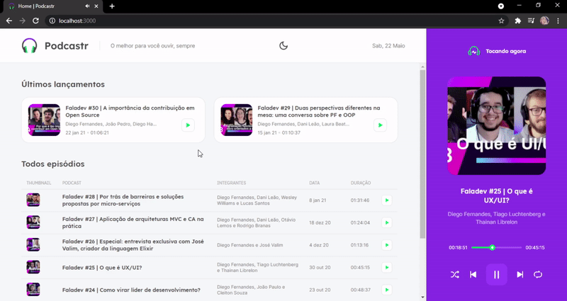
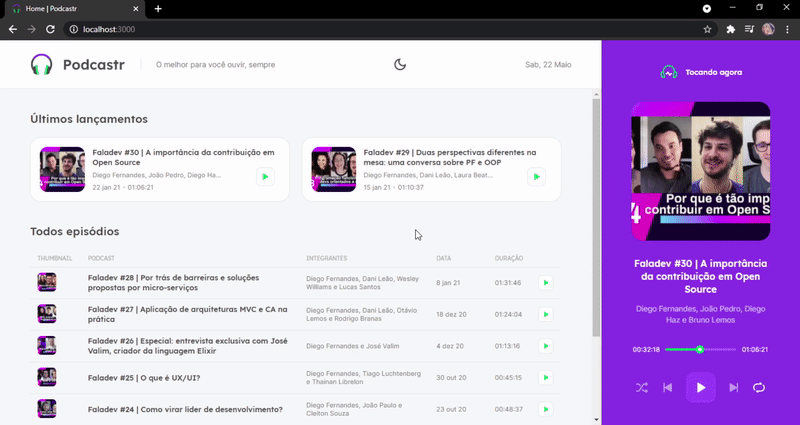
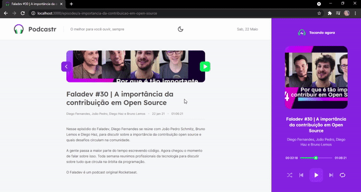
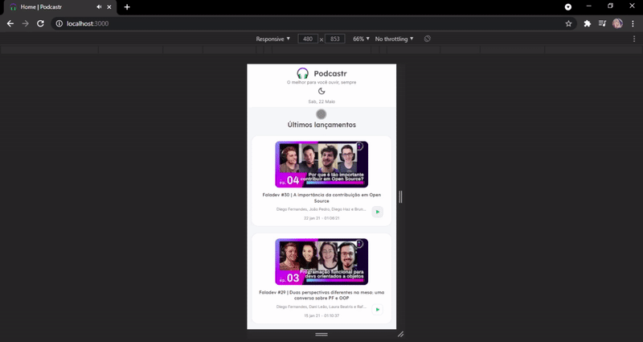
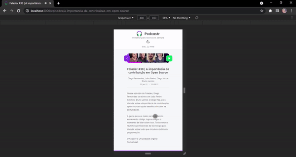
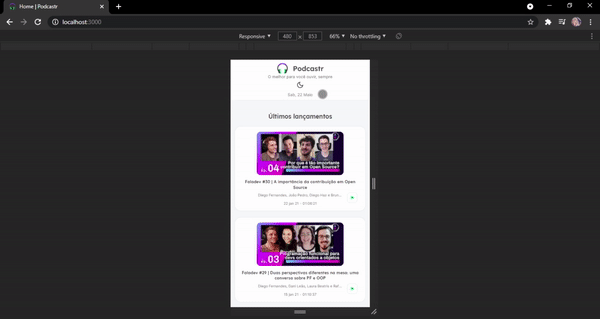

# 🎧 Podcastr

Projeto criado na trilha **ReactJS** durante a Next Level Week 5 da **Rocketseat**. O app feito com ReactJS (Next.js) serve para ouvir podcasts e possui uma breve descrição sobre cada episódio.; <br />

O site é gerado utilizando **Static Site Generation (SSG)**, melhorando assim o desempenho da aplicação, e utiliza uma API fake para busca dos dados dos podcasts, as requisições são realizadas utilizando **Axios**; <br />

O site é feito com a ideia de ser uma **Single Page Application (SPA)** de modo em que a header e o player permaneçam estáticos enquanto o restante da página permanece dinâmica. <br />

# Overview

## 🖥️ Desktop




## Desktop Dark Mode




## 📱 Mobile




## Mobile Dark Mode




# 💿 How to run

```
# Clone this repository
$ git clone https://github.com/velleeda/Podcastr

# Go to the directory
$ cd Podcastr

# Install Dependencies
$ yarn

# Run Web Server
$ yarn dev

# Run Server
$ yarn server

```

# Reference

Me baseei no código do keyyuwan (https://github.com/keyyuwan/Podcastr) para adicionar o dark mode e deixar o site responsivo, pois estava tendo dificuldades.
